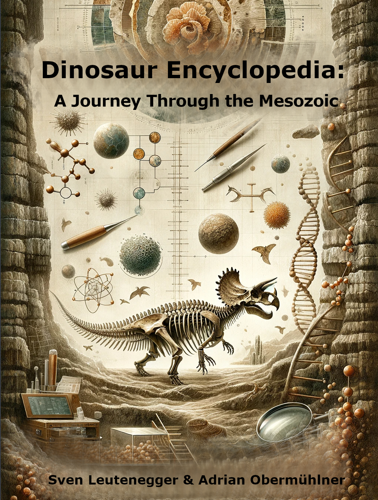

# Dinosaur Encyclopedia: A Journey Through the Mesozoic

Welcome to the GitHub repository for the Dinosaur Encyclopedia, an extensive and scientifically accurate guide through the Mesozoic Era, the age of the dinosaurs. This collaborative effort between **aobermuhlner** and **Svenson-Maximus** aims to produce a detailed book covering the taxonomy of over 160 dinosaur species, their environments throughout the Mesozoic, and the most current and relevant scientific knowledge on these prehistoric creatures.

## Authors
- **aobermuhlner**
- **Svenson-Maximus**

As enthusiasts of paleontology, we are excited to share our knowledge about the dinosaurs that dominated our planet during the Mesozoic Era.

## About the Book

Designed for a diverse audience, the Dinosaur Encyclopedia presents each dinosaur profile with precision and clarity. Inside the book, readers will discover:

- Profiles of over 160 dinosaurs from the Triassic, Jurassic, and Cretaceous periods
- Detailed descriptions of the Mesozoic environments
- Current scientific data and taxonomy
- Vivid illustrations and diagrams to bring the ancient world to life

## Using This Repository

Here, you'll find the LaTeX source files we use to compile the book.

## Contributing
Your contributions can help enhance this project! If you've got suggestions, corrections, or additional content you think would be beneficial, please contribute.

## License
This work is distributed under the Creative Commons Attribution-NonCommercial-ShareAlike 4.0 International License.
